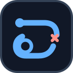
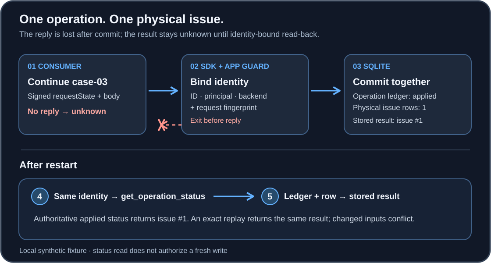

<div align="center">
  

# MCP Continuation Replay

**A local reference for an MCP tool call whose effect commits but whose reply disappears.**

</div>

An assistant resumes a multi-round `create_issue` call. The server writes `issue #1`, then exits before the consumer sees the reply. The next action cannot be decided from the transport error: the write may already exist. This repository runs that failure over real SDK stdio transport, keeps the outcome **unknown**, and shows how a server-side operation record lets the consumer recover the stored result without creating `issue #2`.

The runnable guard is an application-level reference for synthetic identities and one SQLite backend.

> [!NOTE]
> This is a research software preview backed by local tests and retained evidence. It is not a production effect guarantee or an MCP standard. The installed wheel exposes the request-fingerprint command; the guarded servers and recovery demo require the source tree.

[Run the recovery demo](#run-the-recovery-demo) · [How it works](#how-recovery-works) · [Design choices](#design-choices) · [Evidence and limits](#evidence-and-limits) · [Code map](#code-and-evidence-map)

<picture>
  <source media="(max-width: 640px)" srcset="assets/readme/recovery-flow-mobile.svg">
  
</picture>

The diagram's decision is simple: a missing reply never grants a fresh write. The consumer asks for status using the same operation identity. The server reads its durable ledger and effect row; only a matching, authoritative observation can settle the outcome. An exact replay can return the stored result, while changed continuation inputs conflict before effect dispatch.

## Who this is for

| If you are… | Use this repository to… |
|---|---|
| Building a multi-round tool with a side effect | Inspect a small server-side redemption record and the point where a continuation may write. |
| Building a consumer or recovery UI | Model a lost reply as `unknown`, then inspect the identity-bound status and stored result. |
| Reviewing SDK interoperability | Compare pinned Python and TypeScript v2 raw-wire fixtures with their declared, shared SQLite backend. |
| Reviewing an archive or claim | Recheck tracked source bytes and retained local evidence before treating a result as current. |

The fixture creates harmless issue rows. It does not use payments, outbound mail, a real identity provider, or an external issue tracker.

## Run the recovery demo

Use a **source checkout** with Python 3.11 or 3.13 and [uv](https://docs.astral.sh/uv/). Those were the locally gated Python versions; the project declares Python 3.11 or later. From the repository root:

```bash
uv sync --locked --extra dev --python 3.13
demo_dir="$(mktemp -d)/case-03"
uv run --no-sync python -m scripts.demo_lost_reply --output-dir "$demo_dir"
```

The script starts the guarded Python SDK stdio fixture, executes the frozen case-03 sequence, and keeps its raw JSON-RPC transcripts and SQLite database under `$demo_dir/case-03`. It prints a JSON summary. The values to check are:

```json
{
  "input_required": true,
  "operation_id": "case-03",
  "transport_after_commit": "unknown; no reply",
  "status": {
    "operationId": "case-03",
    "principal": "alice",
    "backend": "sqlite:guarded-matrix",
    "state": "applied",
    "authoritative": true,
    "freshWriteAuthorized": false,
    "matchingIds": [1]
  },
  "replay": {"operationId": "case-03", "effectId": 1, "replayed": true, "state": "applied"},
  "physical_issue_rows": 1,
  "physical_operation_rows": 1
}
```

The actual output also names the raw-artifact path and a case label. `transport_after_commit` describes what the consumer knew when the server exited; `status` is later read-back evidence. `replayed: true` means the older case-03 demo sent the *same* continuation after status and received the recorded result. It does not mean a second issue was inserted. The database read-back reports one issue and one operation.

> [!TIP]
> To inspect the result yourself, open `$demo_dir/case-03/crash.transcript.log` and `restart.transcript.log` for the wire exchange, then `store.sqlite3` for the ledger and issue rows. The summary checks both kinds of evidence.

If you start from a generated release ZIP, run the [stdlib public-export verifier](docs/PUBLIC-VERIFICATION.md) on its pristine extracted tree **before** installing dependencies. Its inventory check checks archive contents; its full run also replays retained historical matrices without starting SDK servers. Run the live demo from a source checkout or verified source extraction, with the output directory outside that tree. The [walkthrough](docs/RECOVERY-WALKTHROUGH.md) gives the transcript-by-transcript account.

## How recovery works

1. The first SDK tool call asks for more input and returns `input_required` with signed `requestState`.
2. The continuation supplies the requested body. The guarded application binds its operation ID, configured principal, persisted backend ID, and fingerprint of the logical continuation before it dispatches the effect.
3. SQLite commits the operation record and issue row in one transaction. The fixture then exits before its reply is delivered.
4. The consumer records `unknown`. After restart against the same database and identity configuration, it calls `get_operation_status` for that operation ID.
5. The status reader checks the exact operation ledger and physical issue. The consumer accepts the `applied` observation only when its structured identity and scope match the original attempt. The status carries the stored result; the consumer can return it without redispatching the continuation.

The [case-03 demo](scripts/demo_lost_reply.py) performs one additional exact replay to show that the guard returns its stored result. The separate [status-only recovery test](tests/test_next_recovery.py) stops after step 5 and checks that the restart transcript contains only `get_operation_status`. A query by issue title or body can help diagnose what happened, but it does not prove which operation wrote a row. A missing ledger row is still `unknown`, not proof of non-application.

## What the code supplies

| Component | Responsibility |
|---|---|
| Pinned SDK and [guarded Python stdio server](reference/guarded_server_stdio.py) | Carry the MRTR request and signed continuation state; accept only declared response fields; obtain trusted fixture principal and backend configuration. |
| [Fingerprint contract](src/continuation_replay/fingerprint.py) | Canonicalize the logical request and bind continuation state and input responses with a caller-supplied HMAC key. The [TypeScript adapter](adapters/typescript/src/fingerprint.ts) shares test vectors. |
| [SQLite issue store](reference/backend.py) | Bind operation identity to a fingerprint, write the issue and ledger atomically, return a stored result on an exact retry, and retain expiration boundaries. |
| [Read-back](reference/readback.py) and [consumer](reference/consumer.py) | Produce and evaluate an identity-bound status observation. A transport error alone never becomes `not_applied`. |
| [TypeScript v2 stdio fixture](reference/typescript_guarded_server.cjs) | Exercise another SDK wire integration through a [narrow Python bridge](reference/typescript_guarded_bridge.py) to the **same** SQLite store. |

The [architecture document](docs/ARCHITECTURE.md) describes the trust boundaries. Additional [recovery and transport checks](docs/RECOVERY-AND-TRANSPORT.md) cover status-only recovery, a native TypeScript store, synthetic token identities, and loopback proxy faults. Those are additive local checks with their own schedules; they are separate from the original twelve-case matrices. Node 22 is needed for the TypeScript checks, not for the Python demo above.

## Design choices

**One identity for one logical operation.** A retry reuses the original operation ID. The guarded store also binds the principal and backend, which the server supplies from trusted fixture configuration rather than user-controlled wire arguments. Reusing an ID with changed continuation inputs raises a conflict before a second effect. Inventing a new ID is a fresh operation: the [deliberately unsafe control](tests/test_unsafe_control.py) shows that doing so can create `issue #2`.

**Equivalence is explicit.** The fingerprint includes principal, tool ID and version, canonical arguments, continuation state, and input responses. Objects use a defined key order and compact UTF-8 JSON; accepted numbers are integral within JavaScript's safe range. Opaque state and responses are keyed before the final SHA-256 digest. A caller must supply a secret key of at least 32 bytes. The digest reveals repeated input and does not authenticate a principal. The signed SDK state protects its own request binding; it is not the durable replay ledger.

**Authority and retention are separate.** The server checks whether the continuation is still authorized and whether its existing operation record remains replayable. An expired retained identity is rejected rather than silently treated as new work. Status reads never authorize a fresh write. A compensating action has its own outcome and does not erase a partial original effect. These behaviors are exercised by the [guarded wire cases](tests/test_guarded_wire_matrix.py).

**Read-back settles what transport cannot.** An applied status needs the exact operation ledger, the physical issue row, a matching structured scope, and a stored result consistent with the effect ID. A partial outcome stays partial. An unfinished or absent ledger stays unknown. The reference consumer also requires an observation time, but does not use it as a blanket freshness cutoff: an older immutable terminal record can still be valid.

The SQLite transaction is the relevant atomic boundary here. An external side effect would require its own reliable boundary and recovery model. The reference does not establish exactly-once effects across arbitrary systems.

## Evidence and limits

The original pinned `mcp==2.2.0` unguarded server deliberately has no redemption ledger. Its raw-wire witnesses show duplicate effects after identical or changed continuations and a blind post-crash replay. Under the [2026-07-28 MRTR server requirements](https://modelcontextprotocol.io/specification/2026-07-28/basic/patterns/mrtr), a server that needs at-most-once behavior must enforce it server-side. The unguarded result is an expected control, **not a normative SDK defect**.

In a retained local run, the guarded Python stdio fixture passed [12 frozen cases](docs/research-completion-2026-09-22/raw/attempt-20260922T220129Z-1790114489061895000/SUMMARY.json). They include lost reply, changed input, stripped state, concurrency, read-only recovery, expiry, and partial effect. A separately frozen [TypeScript v2 attempt](docs/research-completion-2026-09-22/typescript-v2/raw/attempt-20260922T220151Z-1790114511892918000/SUMMARY.json) passed the same twelve semantic cases. Its Python bridge uses the same SQLite backend, so the two runs compare SDK wire behavior and integration; they are not independent storage implementations or third-party replication. The older `@modelcontextprotocol/sdk@1.30.0` adapter is fingerprint-only and does not exercise that MRTR surface.

The [current findings](research/CURRENT-FINDINGS.md) distinguish the normative server duty from these observations. [Limitations](research/LIMITATIONS.md) and [security assumptions](SECURITY-AND-ASSUMPTIONS.md) describe what is unproven: real authentication, arbitrary backends, general exactly-once effects, and independent validation. The [fault lab](docs/FAULT-LAB.md) and newer transport checks test additional local failure paths without widening the frozen study. The reported results come from local runs. Check [Actions](https://github.com/jlov7/mcp-continuation-replay/actions) for hosted results on a particular commit; independent replication is not established here.

## If the demo does not match

| Symptom | Check |
|---|---|
| `uv sync` cannot resolve dependencies | Use the locked source tree and a supported Python version. See [development setup](docs/DEVELOPMENT.md); the demo needs development dependencies and a working SDK install. |
| `output must be outside the source checkout` or output already exists | Choose a new directory outside the repository. The demo refuses to overwrite an existing output path. |
| No reply after the continuation | That is the injected fault. Look for `transport_after_commit: "unknown; no reply"`, then the later authoritative status and SQLite row counts. |
| Status is `unknown` or cannot be accepted | Check the operation ID, configured principal, persisted backend ID, structured scope, and stored-result/effect consistency. Do not turn a missing row into `not_applied`. |
| Same ID returns a conflict or an expiry error | Compare continuation inputs and the separate authority/replay deadlines. Changing inputs or reviving a retained expired ID does not authorize a new effect. |
| A fingerprint digest differs across languages | Check the supplied key, canonical JSON value types, tool version, continuation state, and response fields against the [shared vectors](tests/fixtures/fingerprint_vectors.json). |

## Code and evidence map

| Path | Start here for |
|---|---|
| [Walkthrough](docs/RECOVERY-WALKTHROUGH.md) · [architecture](docs/ARCHITECTURE.md) | The exact recovery steps and component trust boundaries. |
| [Guarded wire tests](tests/test_guarded_wire_matrix.py) · [status-only test](tests/test_next_recovery.py) | Live local behavior, raw JSON-RPC assertions, and database read-back. |
| [Development](docs/DEVELOPMENT.md) · [public export verification](docs/PUBLIC-VERIFICATION.md) | Current-source gates and pristine source-archive checks. |
| [Research completion records](docs/research-completion-2026-09-22/PROTOCOL.md) · [current findings](research/CURRENT-FINDINGS.md) | Frozen protocol, retained attempts, and current interpretation. |
| [Repository guide](docs/REPOSITORY-GUIDE.md) | Further source, evidence, and historical-document locations. |

## Contribute and cite

Small changes to the reference or its wire tests are welcome through [Contributing](CONTRIBUTING.md). Include the behavior you expect, a raw-wire assertion where it matters, and independent physical read-back. [Security](SECURITY.md) gives the route for sensitive reports; nonsensitive bugs can use [Issues](https://github.com/jlov7/mcp-continuation-replay/issues). General support is in [SUPPORT.md](SUPPORT.md). The code is under the [MIT License](LICENSE); citation metadata is in [CITATION.cff](CITATION.cff). [AI assistance disclosure](docs/AI-ASSISTANCE.md) describes this project's development record.

<sub>This is a personal research and development project. It is not affiliated with, endorsed by, or sponsored by my employer. Any views expressed are my own.</sub>
